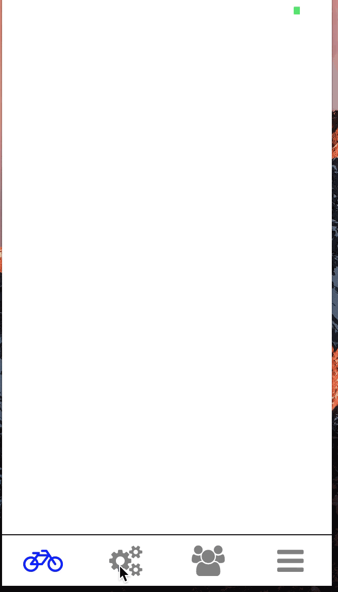

# rn-tab-bar




React-Native tab bar, optional text with icons as well.

Can use local icons or Font Awesome icons

`npm install rn-tab-bar --save`
`npm install react-native-vector-icons --save`
`react-native link`


### Props
| Prop | Type | Description | Required |
| --- | --- | --- | --- |
| tabs | array of objects  | the tabs to render SEE TAB STRUCTURE | **YES**
| containerStyle | object | styles applied to the tab bar container | **YES** |

<br>

#### Tab Structure
| Key | Value | Description | Required |
| --- | --- | --- | ---|
| localIcon | boolean | render a local icon in lieu of FontAwesome icon | **YES** |
| iconProps | icon or image props | transfers props to an Image or FontAwesome Icon depending on the above | **YES** |
| onPress | function | called when the tab is pressed, use this to update you component to respond to tab changes | **YES** |
| text | string | optionally display text under the icon | no |
| textProps | object | optionally style the text | no |
| tabStyle | object | optionally add styles to the individual tabs |

<br>

#### Example

```js

import React from 'react';
import {
  View,
} from 'react-native'

import TabBar from 'rn-tab-bar';

export default class Example extends React.Component {
  constructor(){
    this.selectTab = this.selectTab.bind(this);
    super();
    this.state = {
      selectedTabs: {one:true,two:false,three:false,four:false},
    };
  };

  selectTab(tab){
    let tabs = this.state.selectedTabs;
    for (var i in tabs) {
      ( i === tab ) ? tabs[i] = true:tabs[i] = false
    };
    this.setState({selectedTabs:tabs});
  };

  render(){
    return(

      <View style={{flex:1}}>
        <View style={{flex:1}} />
        <TabBar
          containerStyle={{
            borderTopWidth: 1,
            height:50
          }}
          tabs={[
            {
              localIcon:false,
              iconProps:{
                name: 'bicycle',
                size: 30,
                color: this.state.selectedTabs.one ? 'blue':'gray'
              },
              onPress: () => this.selectTab('one')
            },
            {
              localIcon: false,
              iconProps:{
                name: 'cogs',
                size: 30,
                color: this.state.selectedTabs.two ? 'blue':'gray'
              },
              onPress: () => this.selectTab('two')
            },
            {
              localIcon:false,
              iconProps:{
                name: 'users',
                size: 30,
                color: this.state.selectedTabs.three ? 'blue':'gray'
              },
              onPress: () => this.selectTab('three')
            },
            {
              localIcon: false,
              iconProps:{
                name: 'bars',
                size: 30,
                color: this.state.selectedTabs.four ? 'blue':'gray'
              },
              onPress: () => this.selectTab('four')
            },
          ]}
        />      
      </View>
    )
  };


};


```
